### Фидбек

1. Не нужно делать так, чтобы курсор перепрыгивал в if.
   Он должен оставаться в том же месте, куда его поставил пользователь - чтобы тот смог хоть 100 одноуровневых if-then-else в одном месте вставить.


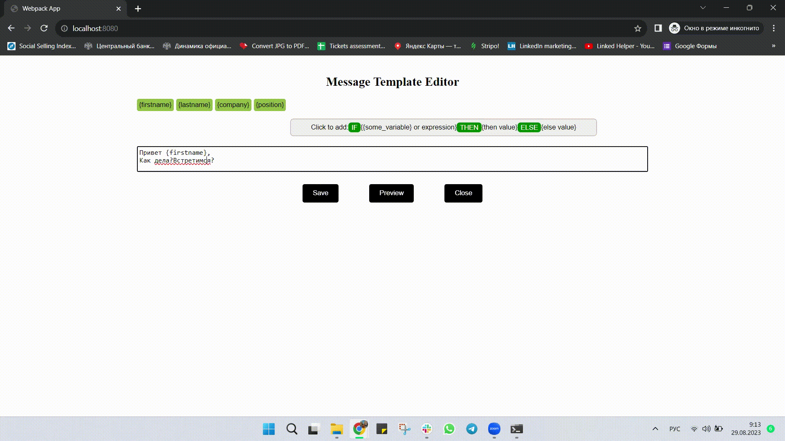


2. Нарушено ТЗ. Я должна иметь возможность вставить if-then-else в любое место, куда ставлю курсор.
   Нажатие на кнопку [IF-THEN-ELSE] должно разбить текущий блок редактирования шаблона сообщения на два блока (текст также разделяется на две части по последней позиции курсора в блоке ввода текста). Между этими блоками добавляется подвиджет [IF-THEN-ELSE].


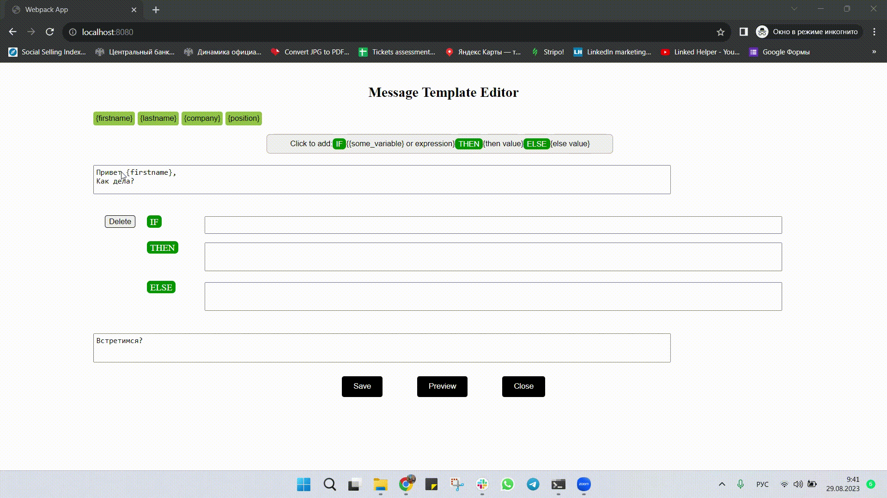


3. Нарушено условие ТЗ - save должна сохранять шаблон перед закрытием. К сожалению, не сохраняет.


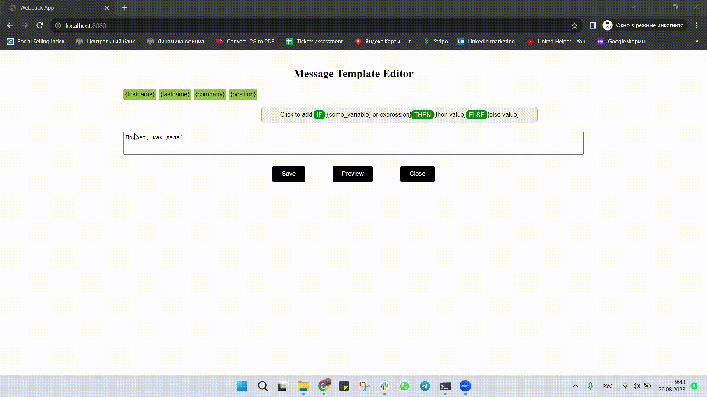


4. При вводе текста {lastname} уже в превью в переменную firstname он должен восприниматься как текст, а не переменная. Тут должно было вывести: {lastname}Оля.


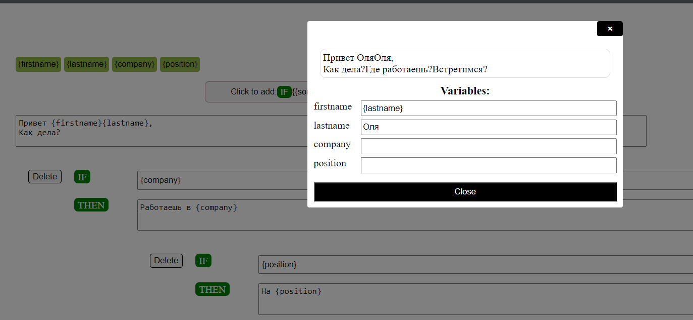


5. Не соблюдено условие ТЗ. При вводе имени и/или фамилии должно было вывести "Есть имя-фамилия".
   Исполняется THEN ветка, если после вычисления IF получилась не пустая строка, в противном случае выполняется ELSE ветка.


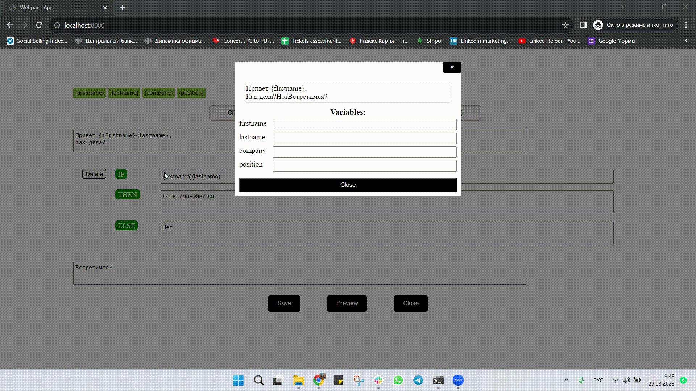


6. Не соблюдено условие ТЗ. При наличии текста в if должно было вывести "Есть текст".
   Исполняется THEN ветка, если после вычисления IF получилась не пустая строка, в противном случае выполняется ELSE ветка.


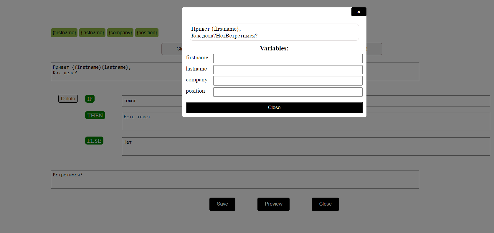


7. Не могу поменять переменные.


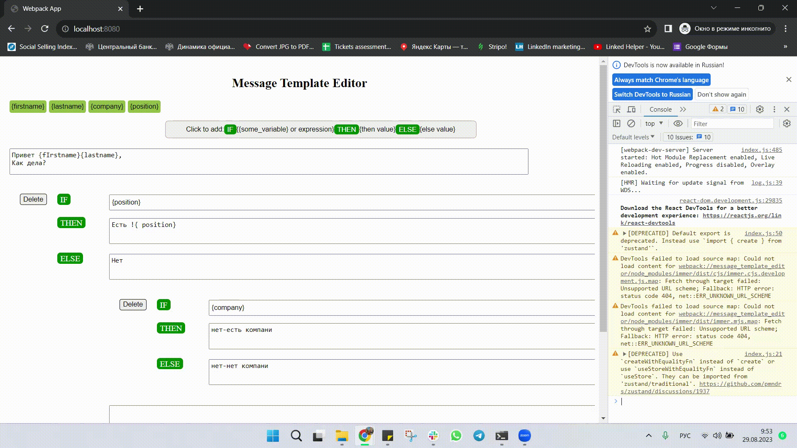


---


# Ответ на feedback

1. Видео из [ютуба](https://www.youtube.com/watch?v=pmc4RAYvRx8&t=535s) или [можно скачать отсюда](imagesForReadme/ifThenElse_Demo.mp4), 
здесь на 1:40 разбивается ifThenElse и курсор перепрыгивает в блок if,
куда курсор должен перепрыгивать в [ТЗ](readme.md) не сказано, но в [ТЗ](readme.md) есть ссылка на [доку](https://support.linkedhelper.com/hc/en-us/articles/360015590120-How-to-create-message-templates#h_01EJPC64XQ3ZJX6T063M777KB5) с этим видео и в видео демонстрируется,
как после разбития блока, курсор перепрыгивает в блог if;


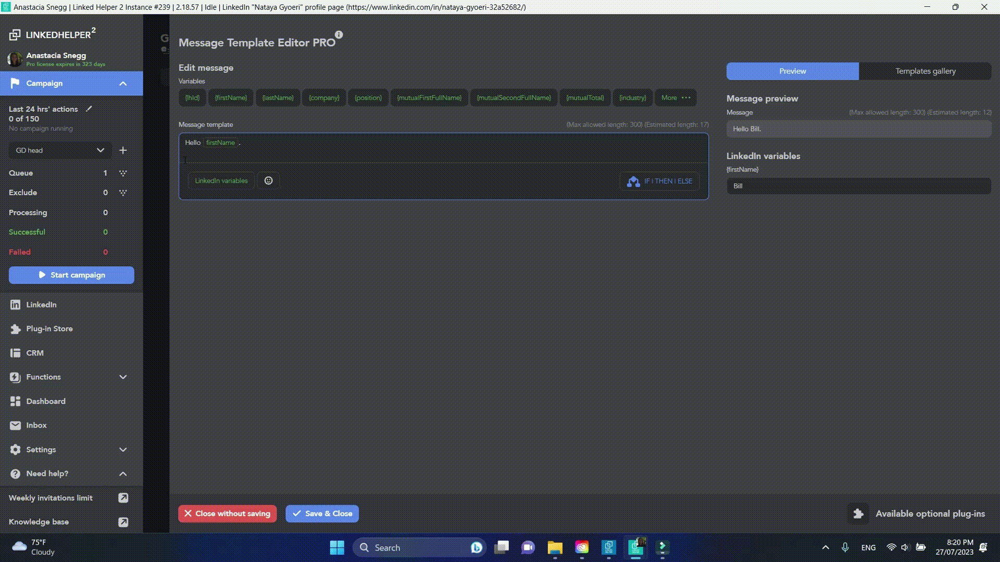 


2. согласен, да действительно в [документации](https://support.linkedhelper.com/hc/en-us/articles/360015590120-How-to-create-message-templates#h_01EJPC64XQ3ZJX6T063M777KB5), есть скриншот и несколько слов об одно уровневых ifThenElse;


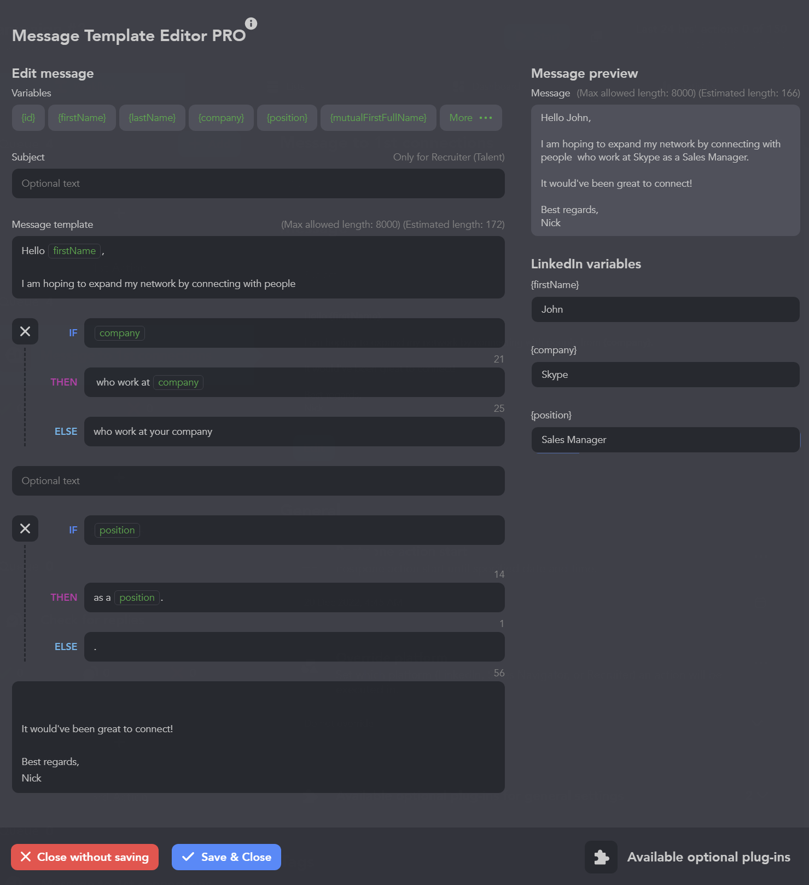


3. согласен это отклонение от [ТЗ](readme.md), там правда в localStorage по onChange сохранялось,
   а кнопкой "close" я обнулял messageTemplateEditor, т.е. сохранение я сделал, но ушёл от [ТЗ](readme.md),
   так что - да, косяк;

4. согласен, это косяк;

5. цитирую текст из [документации](https://support.linkedhelper.com/hc/en-us/articles/360015590120-How-to-create-message-templates#h_01EJPC64XQ3ZJX6T063M777KB5) - ```One operator - one variable in the IF string```,
перевожу - "оператор IF поддерживает только одну переменную",
нет в [ТЗ](readme.md) текста про несколько переменных в IF, а раз нет, то взял за основу информацию из [документации](https://support.linkedhelper.com/hc/en-us/articles/360015590120-How-to-create-message-templates#h_01EJPC64XQ3ZJX6T063M777KB5).


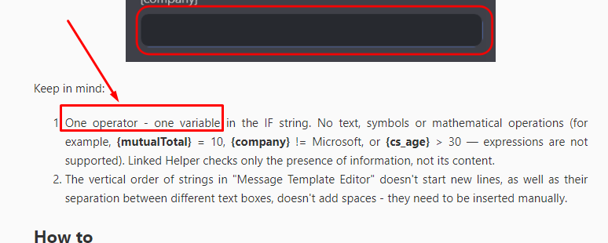


6. цитирую текст из [документации](https://support.linkedhelper.com/hc/en-us/articles/360015590120-How-to-create-message-templates#h_01EJPC64XQ3ZJX6T063M777KB5) - ```No text, symbols or mathematical operations (for example...```,
так что в feedback есть противоречие [документации](https://support.linkedhelper.com/hc/en-us/articles/360015590120-How-to-create-message-templates#h_01EJPC64XQ3ZJX6T063M777KB5);


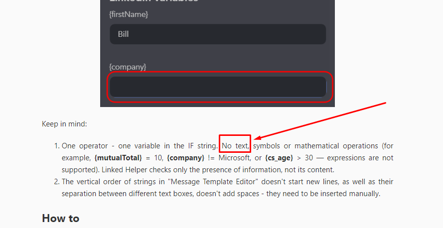


7) согласен, но переменные я хранил в ```instance``` класса ```MessageTemplate```, этот ```instance``` сохранял в ```localStorage``` по ```onChange``` (вместе с ключами переменных), косяк здесь был
лишь в том, что переменные я хранил не по ключу в ```localStorage``` согласно [ТЗ](readme.md) отдельно, а внутри ```instance``` класса ```MessageTemplate```,
который в формате ```DTO``` сохранял в ```localStorage```.

---

Итого, что мы имеем:
1) не согласен;
2) принял;
3) принял;
4) принял;
5) не согласен;
6) не согласен;
7) принял.

Таким образом, 3 пункта в feedback противоречит [ТЗ](readme.md), остальные 4 - справедливые замечания.
Так или иначе, ВСЕ 7 пунктов были "закрыты" и приложение теперь соответствует всем 7-и.
