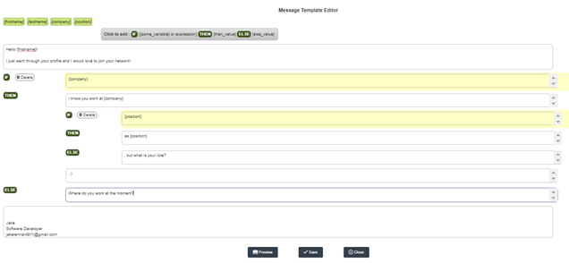
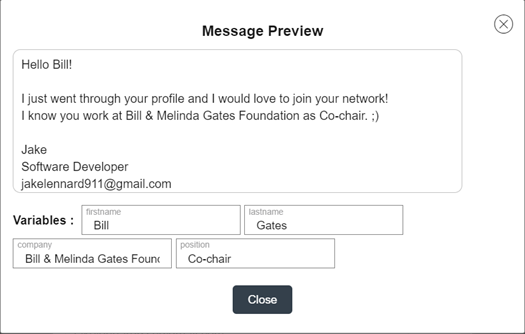
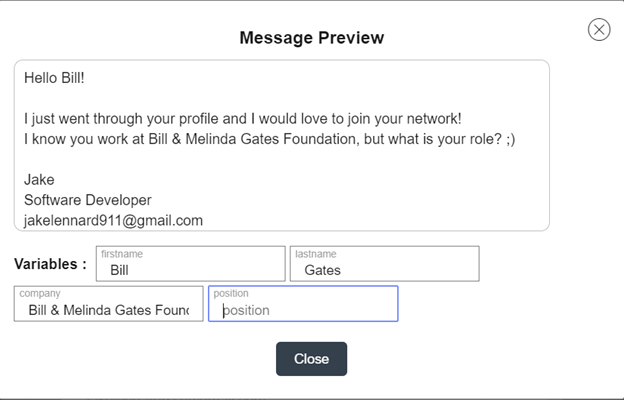
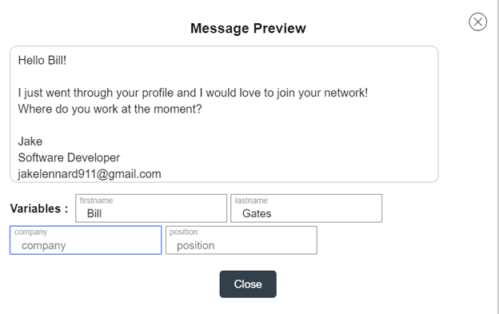

### Message Template Editor, ссылка на [решение задачи](https://rasoan.github.io/messageTemplateEditor).

---

Необходимо разработать редактор шаблонов сообщений и виджет предпросмотра сообщений.

### Условный скриншот редактора

### Виджет предпросмотра шаблона сообщений:
1. Все переменные заполнены;

2. Заполнены все переменные, кроме position;

3. Заполнены только firstname и lastname.

Требования к виджету редактирования шаблона сообщений:
1)	На вход виджет получает:
   - arrVarNames [required] - массив имен переменных;
   - template [optional] - шаблон сообщения;
   - callbackSave - асинхронная функция сохранения шаблона.
2)	Работа с переменными:
   - на основании массива переменных должен быть создан подвиджет из кнопок-имен переменных,
обернутых в фигурные скобки. Например, “firstname” -> “{firstname}”;
   - клик по такой переменной должен добавлять ее в последнее место,
где был курсор ввода в блоке ввода текста или в начало шаблона, если курсор еще не указывался.
3)	Кнопка [IF-THEN-ELSE]:
   - в верхней части виджета где-либо должна быть добавлена кнопка [IF-THEN-ELSE];
   - нажатие на кнопку [IF-THEN-ELSE] должно разбить текущий блок редактирования шаблона сообщения на два блока
(текст также разделяется на две части по последней позиции курсора в блоке ввода текста). 
Между этими блоками добавляется подвиджет [IF-THEN-ELSE].
4)	Подвиджет [IF-THEN-ELSE]:
   - состоит из 3х блоков: IF, THEN и ELSE;
   - в каждом из этих блоков пользователь может писать текст, добавлять переменные по нажатию на кнопки добавления переменных, 
а также добавлять вложенные виджеты [IF-THEN-ELSE];
   - исполняется THEN ветка, если после вычисления IF получилась не пустая строка, в противном случае выполняется ELSE ветка;
   - где-либо внутри блока должна быть предусмотрена кнопка DELETE, нажатие на которую отменяет добавление данного виджета,
склеивая блоки над и под ним в один;
   - в блоке IF нет логических операций, то есть если пользователь напишет в нем AND, &&, OR, || - то это просто текст с точки зрения виджета.
5)	Кнопка Close закрывает виджет - реализация диалога “сохранить изменения?” не обязательна.
6)	Кнопка Preview - открывает поверх виджет предпросмотра шаблона.
7)	Кнопка Save - вызывает callbackSave с актуальным шаблоном.
8)	Формат шаблона сообщения должен быть разработан в рамках решения данной задачи. Он должен удовлетворять следующим критериям:
   - сериализуется и десериализуется в строку;
   - отсутствие side effects - какой бы текст, кроме имён переменных, не ввел пользователь, он должен обрабатываться строго как текст.
   - если пользователь что-либо вводит в фигурных скобках отличное от заранее указанной переменной, то это должно восприниматься, как обычный текст.
9)	Особых требований к стилям нет. Иконки к кнопкам добавлять необязательно. Если сделаете красиво и аккуратно, то будет плюсом.
10)	Область ввода должна автоматически менятся по высоте так, чтобы не появлялся скролл

У нас в приложении реализован более навороченный функционал, но тем нее менее можно потыкаться и понять общую логику редактора шаблонов сообщения [ссылка](https://support.linkedhelper.com/hc/en-us/articles/360015590120-How-to-create-message-templates)

Требования к виджету предпросмотра шаблона сообщений:
1)	На вход виджет получает:
   - arrVarNames [required] - массив имен переменных;
   - template [required] - шаблон сообщения.
2)	Виджет состоит из трех частей
   - Не редактируемая область просмотра сгенерированного сообщения;
   - Поля ввода значений переменных;
   - Кнопка close.
3)	Сгенерированное сообщение должно меняться на лету при вводе значений переменных.
4)	Визуально всегда должно быть видно, какая переменная какое значение имеет.
5)	Требований к стилистике и дизайну нет. На скриншотах выше представлен один из возможных вариантов.
6)	Генератор сообщения на шаблоне должен быть выделен в отдельную функцию.

Требования к функции-генератору сообщений
1)	На вход функция получает:
      template [required] - шаблон сообщения
      values [required] - значения переменных (объект вида {name : value}). В объекте могут присутствовать, 
как лишние пары name & value - должны игнорироваться, так и отсутствовать необходимые - должны интерпретироваться, как пустые значения;
2)	На выходе сгенерированная строка.
3)	У функции не должно быть side effects. Не должно быть такого, что какой-либо пользовательский текст интерпретировался, как оператор.
4)	Функция должна иметь 100% покрытие тестами.

Требования к проекту в целом
1)	Проект должен быть представлен в виде HTML странички с кнопкой “Message Editor”.
2)	При нажатии на кнопку “Message Editor” открывается виджет Message Template Editor с переменными:
      arrVarNames = localStorage.arrVarNames ? JSON.parse(localStorage.arrVarNames) : [‘firstname’, ‘lastname’, ‘company’, ‘position’];
      template = localStorage.template  ? JSON.parse(localStorage.template) : null;
      callbackSave - функция, которая записывает шаблон в localStorage.template
3)	Задача реализуется на React и TypeScript без использования UI-фреймворков. Использование бесплатных сторонних библиотек возможно, но нежелательно - хотя для автосайза высоты области ввода текста будет нормально использовать готовую библиотеку.
4)	Для настройки окружения используйте create-react-app последней версии.

Обязательные требования к решению
1)	Полная функциональность в соответствии с изложенными требованиями
2)	Отсутствие багов и потенциальных уязвимостей
3)	Отсутствие зависаний интерфейса (например, при установке курсора в поле ввода и зажимании клавиши с буквой на клавиатуре).

Рекомендации к выполнению задания
1)	Не нужно делать поля ввода в виде div с contenteditable = true.
2)	Использовать изоляцию стилей (предпочтительно css-модули)
3)	Использовать React hooks
4)	Желательно использование анимаций
5)	Наличие комментариев к коду, решение должно быть написано так, чтобы потом его мог легко понять и поддерживать другой разработчик.

